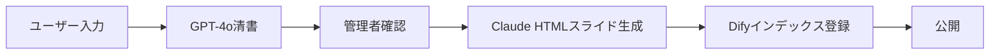
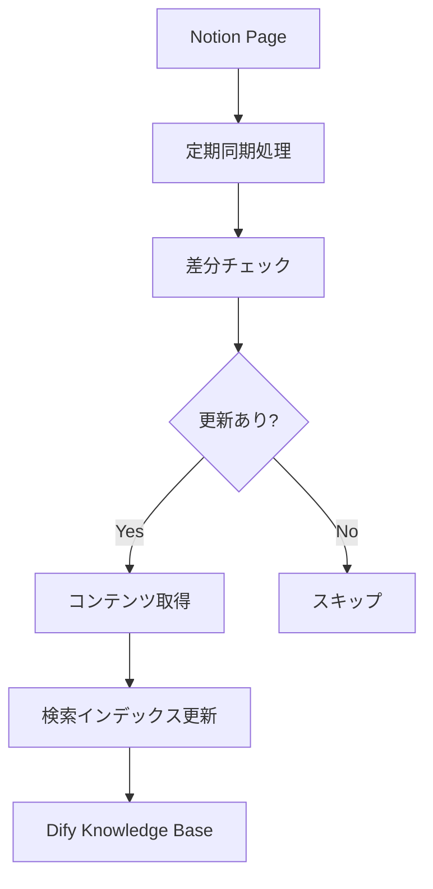

# メドナビAI 開発ガイド

## 🏥 プロジェクト概要

メドナビAIは、しおや消化器内科クリニック専用のAIチャットボットシステムです。院内マニュアルや業務知識を一元管理し、スタッフの質問に即座に回答することで、業務効率化と医療サービスの質向上を実現します。

### 主要機能

1. **AIチャット機能（3種類のAI）**
   - 算定AI：レセプト算定・診療報酬に関する質問対応
   - クリニック業務AI：受付・診療・院内業務全般の質問対応
   - 健診業務AI：健康診断・人間ドックに関する質問対応

2. **マニュアル作成機能**
   - 3ステップでのマニュアル作成（入力→GPT-4o清書→Claude資料化）
   - テンプレート機能（手順/チェックリスト/FAQ）
   - HTML形式のインタラクティブスライド生成

3. **マニュアル管理機能**
   - Notion連携によるマニュアル管理
   - 自動同期機能（15分間隔）
   - 検索・フィルタリング機能

## 🚀 クイックスタート

### 前提条件
- Node.js 18以上
- npm または yarn
- Git

### セットアップ手順

```bash
# リポジトリのクローン
git clone https://github.com/shoto-dotf/medonavi_izumi.git
cd medonavi_izumi

# 依存関係のインストール
npm install

# 環境変数の設定
cp .env.example .env
# .envファイルを編集してAPIキーを設定

# 開発サーバーの起動
npm run dev
```

### 環境変数の設定

`.env`ファイルに以下の設定を追加：

```env
# API Keys
VITE_DIFY_API_KEY=your_dify_api_key_here
VITE_DIFY_API_URL=https://api.dify.ai/v1
VITE_DIFY_GPT_APP_ID=your_gpt_app_id
VITE_DIFY_CLAUDE_APP_ID=your_claude_app_id
VITE_NOTION_API_KEY=your_notion_api_key_here

# Environment
VITE_NODE_ENV=development
```

## 📁 プロジェクト構造

```
medonaviai/
├── src/
│   ├── api/              # API連携クライアント
│   │   ├── dify.ts      # Dify API（GPT-4o & Claude）
│   │   ├── claude.ts    # Claude API（直接連携用）
│   │   └── notion.ts    # Notion API
│   ├── components/       # UIコンポーネント
│   │   ├── ChatArea.tsx
│   │   ├── ChatInput.tsx
│   │   ├── ChatMessage.tsx
│   │   ├── MainLayout.tsx
│   │   └── Sidebar.tsx
│   ├── contexts/         # React Context
│   │   ├── AuthContext.tsx
│   │   └── ChatContext.tsx
│   ├── pages/           # ページコンポーネント
│   │   ├── ChatPage.tsx
│   │   ├── Login.tsx
│   │   ├── ManualCreation.tsx
│   │   └── ManualManagement.tsx
│   ├── types/           # TypeScript型定義
│   └── utils/           # ユーティリティ
├── public/              # 静的ファイル
└── package.json
```

## 🔧 技術スタック

### フロントエンド
- **Framework**: React 18
- **Language**: TypeScript
- **Styling**: Tailwind CSS
- **Routing**: React Router v6
- **State Management**: React Context API
- **Build Tool**: Vite

### AI連携
- **Dify Platform**: ワークフロー管理
- **OpenAI GPT-4o**: マニュアル清書処理
- **Anthropic Claude 3.5 Sonnet**: HTMLスライド生成
- **Notion API**: マニュアル連携

## 📋 機能仕様

### 1. AIチャット機能

```typescript
// AI種別の定義
type AIType = 'calculation' | 'clinic' | 'health-check';

// チャット処理フロー
1. ユーザーがAIを選択
2. 質問を入力
3. Dify経由でベクトル検索
4. 該当マニュアルから回答生成
5. 参照元を含めて表示
```

### 2. マニュアル作成機能（3ステップフロー）

```typescript
// ステータス遷移
type ManualStatus = 
  | 'draft'           // 下書き
  | 'refining'        // GPT-4o処理中
  | 'pending'         // 管理者確認待ち
  | 'processing'      // スライド生成中
  | 'active';         // 公開中

// データフロー
interface ManualData {
  // Step 1: ユーザー入力
  raw_content: string;
  metadata: {
    user_id: string;
    category: string;
    created_at: string;
  };
  
  // Step 2: GPT-4o清書結果
  refined_content: string;
  structure: {
    sections: string[];
    estimated_slides: number;
  };
  
  // Step 3: 管理者処理後
  status: ManualStatus;
  slide_html?: string;
  dify_index_id?: string;
}
```

### 3. マニュアル管理機能（Notion連携）

```typescript
// Notion連携設定
const notionConfig = {
  apiKey: process.env.VITE_NOTION_API_KEY,
  syncInterval: 15 * 60 * 1000, // 15分
  rateLimit: 3, // 3リクエスト/秒
};

// 同期ステータス
type SyncStatus = 'synced' | 'syncing' | 'error' | 'pending';
```

## 🔄 データフロー

### マニュアル作成フロー



### Notion同期フロー



## 🛠️ 開発ガイドライン

### コーディング規約

1. **TypeScript**: 厳密な型定義を使用
2. **React**: 関数コンポーネント + Hooksを使用
3. **命名規則**: 
   - コンポーネント: PascalCase
   - 関数: camelCase
   - 定数: UPPER_SNAKE_CASE

### コミットメッセージ

```
feat: 新機能の追加
fix: バグ修正
docs: ドキュメント更新
style: フォーマット修正
refactor: リファクタリング
test: テスト追加
chore: ビルドプロセスや補助ツールの変更
```

### ブランチ戦略

```
main         # 本番環境
├── develop  # 開発環境
    ├── feature/manual-creation  # 機能開発
    └── fix/chat-bug            # バグ修正
```

## 📝 API仕様

### エンドポイント一覧

```yaml
# チャット関連
POST /api/chat
  body: { message, ai_type, context }
  response: { answer, sources }

# マニュアル作成
POST /api/manual/draft
  body: { content, metadata }
  response: { draft_id }

POST /api/manual/refine
  body: { draft_id }
  response: { refined_content }

POST /api/manual/complete
  body: { manual_id, refined_content }
  response: { status }

# マニュアル管理
GET /api/manuals
  query: { status, category, search }
  response: { manuals[] }

POST /api/manual/notion/sync
  body: { manual_id }
  response: { sync_status }
```

## 💰 料金試算

### API利用料金（月間）
```
マニュアル作成（10本/月）:
  - GPT-4o清書: 22円 × 10 = 220円
  - Claude スライド生成: 82円 × 10 = 820円
  
Q&A機能（1000質問/月）:
  - GPT-4o: 約1,000円
  
合計: 約2,040円/月
```

## 🔒 セキュリティ

1. JWT認証によるアクセス制御
2. HTTPS通信の完全暗号化
3. PHI（患者健康情報）は扱わない
4. APIキーの環境変数管理
5. 定期的なセキュリティ監査

## 📅 リリース計画

### Phase 1（現在実装中）
- ✅ 基本的なチャット機能
- ✅ マニュアル作成（手動処理含む）
- ✅ Notion連携（読み取りのみ）

### Phase 2（3ヶ月後）
- ⬜ 完全自動化（管理者処理の自動化）
- ⬜ リアルタイムコラボレーション
- ⬜ 高度な検索機能

### Phase 3（6ヶ月後）
- ⬜ 音声・動画対応
- ⬜ 多言語対応
- ⬜ API公開

## 🧪 テスト

```bash
# ユニットテスト
npm run test

# E2Eテスト
npm run test:e2e

# カバレッジレポート
npm run test:coverage
```

## 🚨 トラブルシューティング

### よくある問題

1. **ポート競合エラー**
   ```bash
   # 別のポートで起動
   npm run dev -- --port 3001
   ```

2. **APIキーエラー**
   - `.env`ファイルの設定を確認
   - APIキーの有効期限を確認

3. **ビルドエラー**
   ```bash
   # キャッシュクリア
   rm -rf node_modules
   npm install
   ```

## 📞 サポート

- **技術的な質問**: GitHub Issues
- **緊急の問題**: 管理者に直接連絡

## 📄 ライセンス

このプロジェクトはプライベートライセンスです。